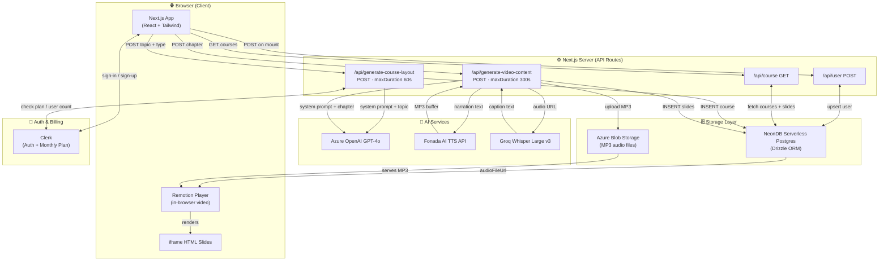
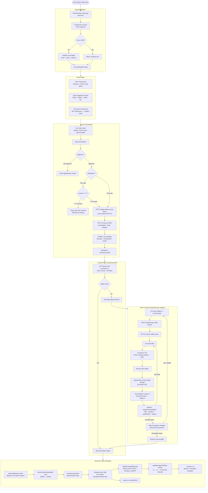
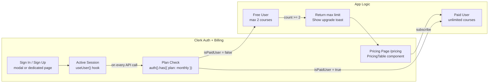
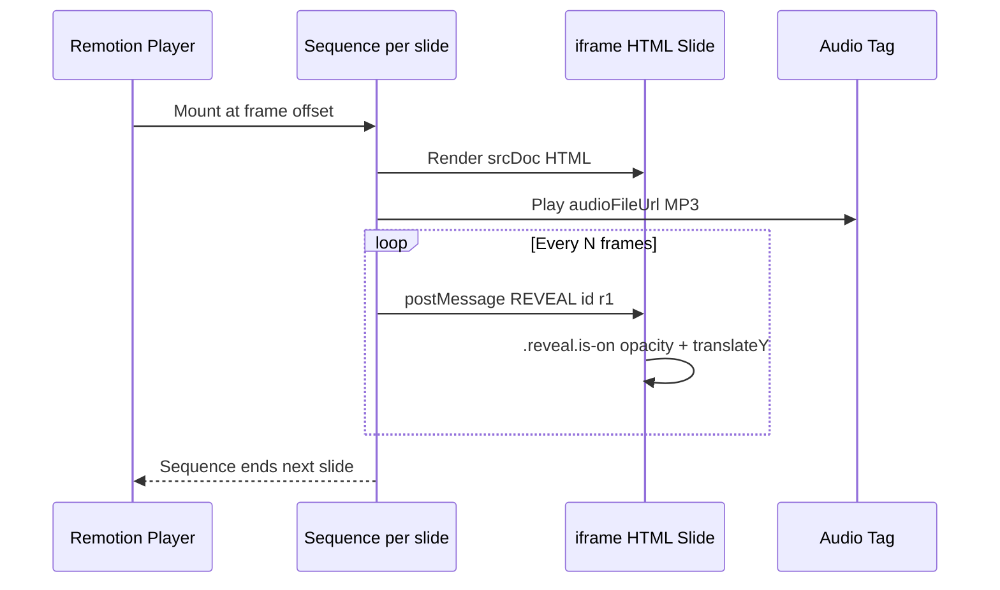
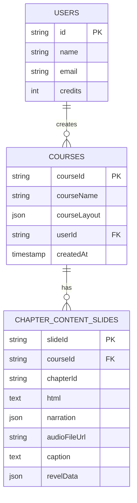

# 🎓 VidCourse — AI-Powered Video Course Generator

<div align="center">


**Turn any topic into a fully animated, narrated video course using AI — in seconds.**

[🚀 Live Demo](https://ai-video-course-generator.vercel.app) · [📖 Documentation](#-getting-started) · [🐛 Report Bug](https://github.com/sahutushar/ai-video-course-generator/issues)

</div>

---

## 📌 What is VidCourse?

VidCourse is a production-ready full-stack **Next.js 16** application that transforms any topic into a fully structured, narrated, and animated video course — completely powered by AI.

A user simply types a topic (e.g. *"React Hooks"* or *"Python for Beginners"*), and the app:

1. **Generates** a structured course layout with chapters and sub-topics using **Azure OpenAI GPT-4o**
2. **Creates** animated Tailwind HTML slides for each sub-topic
3. **Narrates** every slide with AI-generated MP3 audio via **Fonada TTS**
4. **Transcribes** audio into captions using **Groq Whisper Large v3**
5. **Plays** everything back as a real video timeline in the browser using **Remotion**

No video editing. No manual work. Just type and watch.

---

## ✨ Features

| # | Feature | Powered By |
|---|---|---|
| 1 | AI course structure (chapters, levels) | Azure OpenAI GPT-4o |
| 2 | Animated Tailwind HTML slides per sub-topic | Azure OpenAI GPT-4o |
| 3 | Text-to-Speech narration audio (MP3) | Fonada AI TTS |
| 4 | Auto-captions from audio | Groq Whisper Large v3 |
| 5 | In-browser video player with timeline | Remotion Player |
| 6 | Progressive slide reveal animations | postMessage + CSS |
| 7 | Auth + freemium billing | Clerk |
| 8 | Persistent storage | NeonDB + Drizzle ORM |
| 9 | Audio file hosting | Azure Blob Storage |
| 10 | Free tier (2 courses) + paid unlimited plan | Clerk Monthly Billing |

---

## 🧱 Tech Stack

| Layer | Technology | Purpose |
|---|---|---|
| Framework | Next.js 16 (App Router) | Full-stack React framework |
| Language | TypeScript | Type safety across the codebase |
| Styling | Tailwind CSS v4 + shadcn/ui | Utility-first UI components |
| Auth & Billing | Clerk | Authentication + freemium plan management |
| AI — Course Layout | Azure OpenAI (GPT-4o) | Generate structured course JSON |
| AI — Slide HTML | Azure OpenAI (GPT-4o) | Generate animated HTML slides |
| AI — Captions | Groq (Whisper Large v3) | Transcribe MP3 audio to captions |
| TTS — Narration | Fonada AI TTS API | Convert text to MP3 narration |
| Video Rendering | Remotion (Player + Sequence + Audio) | In-browser video timeline |
| Database | NeonDB (serverless Postgres) | Store users, courses, slides |
| ORM | Drizzle ORM | Type-safe database queries |
| File Storage | Azure Blob Storage | Host generated MP3 audio files |
| HTTP Client | Axios | API request handling |
| Notifications | Sonner | Toast notifications |
| Date Formatting | Moment.js | Human-readable timestamps |

---

## 🏗️ High-Level System Architecture

> How every service connects together from the browser to the cloud.



---

## 🔄 Complete End-to-End Working Flow

> The full journey from "user opens the site" to "video plays in browser".



---

## 🔐 Authentication & Billing Flow



---

## 🎬 Remotion Slide Reveal System

> How a static HTML slide becomes a timed animated video sequence.



---

## 🗄️ Database Schema



---

## 📁 Project Structure

```
├── app/
│   ├── _components/            # Header, Hero, CourseList, CourseListCard
│   ├── (auth)/                 # Clerk sign-in / sign-up pages
│   ├── (routes)/
│   │   └── course/[courseId]/  # Course detail page + Remotion player
│   │       └── _components/    # CourseInfoCard, CourseChapters, ChapterVideo
│   ├── api/
│   │   ├── user/               # POST — upsert user on mount
│   │   ├── course/             # GET — fetch course + slides
│   │   ├── generate-course-layout/   # POST — GPT-4o course structure
│   │   └── generate-video-content/   # POST — GPT-4o slides + TTS + Whisper
│   ├── context/                # UserDetailContext (global user state)
│   ├── data/                   # Constants, AI prompts, dummy data
│   ├── pricing/                # Clerk PricingTable page
│   ├── type/                   # TypeScript interfaces (Course, Slide, etc.)
│   ├── globals.css
│   ├── layout.tsx              # ClerkProvider + Provider wrapper
│   ├── page.tsx                # Home page
│   └── provider.tsx            # User init + context provider
├── config/
│   ├── db.tsx                  # NeonDB + Drizzle connection
│   ├── openai.ts               # Azure OpenAI client config
│   └── schema.tsx              # Drizzle table schemas
├── components/ui/              # shadcn/ui component library
├── hooks/                      # use-mobile hook
├── public/                     # Static assets (logo, banners)
├── .env.example                # Environment variable reference
├── drizzle.config.ts           # Drizzle ORM config
├── next.config.ts              # Next.js config
└── vercel.json                 # Vercel function timeout config
```

---

## 🚀 Getting Started

### Prerequisites

- Node.js 18+
- npm or yarn
- Accounts for: Azure OpenAI, Groq, Fonada TTS, Clerk, NeonDB, Azure Blob Storage

### 1. Clone & Install

```bash
git clone https://github.com/sahutushar/ai-video-course-generator.git
cd ai-video-course-generator
npm install
```

### 2. Environment Variables

```bash
cp .env.example .env
```

Fill in all values in `.env`:

```env
# Clerk Auth
NEXT_PUBLIC_CLERK_PUBLISHABLE_KEY=
CLERK_SECRET_KEY=

# Azure OpenAI
AZURE_OPENAI_API_KEY=
AZURE_OPENAI_ENDPOINT=
AZURE_OPENAI_DEPLOYMENT=

# Groq (Whisper)
GROQ_API_KEY=

# Fonada TTS
FONADA_API_KEY=

# NeonDB
DATABASE_URL=

# Azure Blob Storage
AZURE_STORAGE_CONNECTION_STRING=
AZURE_STORAGE_CONTAINER_NAME=
```

### 3. Push Database Schema

```bash
npx drizzle-kit push
```

### 4. Run Development Server

```bash
npm run dev
```

Open [http://localhost:3000](http://localhost:3000)

---

## 🌐 Deploy on Vercel

[](https://vercel.com/new)

1. Push your repo to GitHub
2. Import into Vercel
3. Add all environment variables from `.env.example`
4. Deploy — Vercel handles the rest

> The `vercel.json` in this repo already configures extended function timeouts (60s for layout generation, 300s for video content generation).

---

## 🔑 Key Technical Decisions

| Decision | Reason |
|---|---|
| Remotion over `<video>` | Enables frame-accurate sync between audio, slides, and reveal animations entirely in the browser — no server-side rendering needed |
| Azure Blob for MP3s | Remotion's Audio component requires a public HTTPS URL; blob storage provides permanent, fast CDN-backed URLs |
| Groq Whisper over OpenAI Whisper | 10–20× faster transcription at lower cost for real-time caption generation |
| Drizzle over Prisma | Lighter weight, better TypeScript inference, and native support for NeonDB serverless driver |
| Clerk over NextAuth | Built-in billing/plan management eliminates the need for a separate payment integration |

---

## 📄 License

MIT © [Tushar Sahu](https://github.com/sahutushar)
