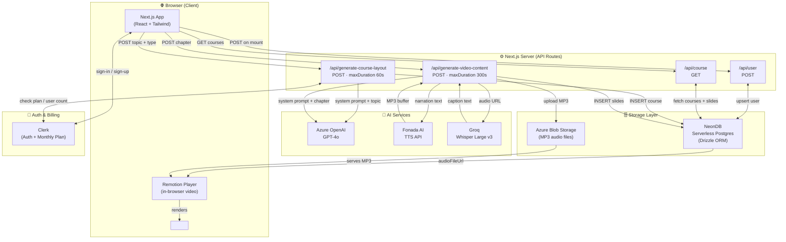
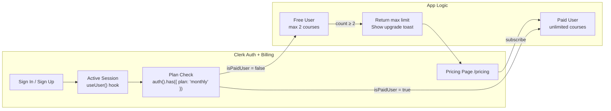

# 🎓 VidCourse — AI-Powered Video Course Generator

> Turn any topic into a fully animated, narrated video course using AI — in seconds.

VidCourse is a full-stack **Next.js 16** application. A user types a topic, and the app automatically generates a structured course with animated HTML slides, AI-narrated MP3 audio per slide, auto-captions via Whisper, and plays everything back as a real video timeline inside the browser using **Remotion**.

---

## ✨ Features at a Glance

| # | Feature | Powered By |
|---|---|---|
| 1 | AI course structure (chapters, levels) | Azure OpenAI GPT-4o |
| 2 | Animated Tailwind HTML slides per sub-topic | Azure OpenAI GPT-4o |
| 3 | Text-to-Speech narration audio (MP3) | Fonada AI TTS |
| 4 | Auto-captions from audio | Groq Whisper Large v3 |
| 5 | In-browser video player with timeline | Remotion Player |
| 6 | Progressive slide reveal animations | postMessage + CSS |
| 7 | Auth + freemium billing | Clerk |
| 8 | Persistent storage | NeonDB + Drizzle ORM |
| 9 | Audio file hosting | Azure Blob Storage |

---

## 🧱 Tech Stack

| Layer | Technology |
|---|---|
| Framework | Next.js 16 (App Router) |
| Language | TypeScript |
| Styling | Tailwind CSS v4 + shadcn/ui |
| Auth & Billing | Clerk (with monthly plan) |
| AI — Course Layout | Azure OpenAI (GPT-4o) |
| AI — Slide HTML | Azure OpenAI (GPT-4o) |
| AI — Captions | Groq (Whisper Large v3) |
| TTS — Narration | Fonada AI TTS API |
| Video Rendering | Remotion (Player + Sequence + Audio) |
| Database | NeonDB (serverless Postgres) |
| ORM | Drizzle ORM |
| File Storage | Azure Blob Storage |
| HTTP Client | Axios |
| Notifications | Sonner (toast) |
| Date Formatting | Moment.js |

---

## 🏗️ High-Level System Architecture



---

## 🔄 Complete End-to-End Working Flow

```mermaid
flowchart TD
    START([👤 User Opens VidCourse]) --> CLERK_WRAP

    subgraph INIT["App Initialization"]
        CLERK_WRAP["ClerkProvider wraps app\nlayout.tsx"]
        PROVIDER["Provider.tsx mounts\nPOST /api/user"]
        CHECK_USER{User in DB?}
        INSERT_USER["INSERT usersTable\nname · email · credits=2"]
        RETURN_USER["Return existing user"]
        CTX["Set UserDetailContext"]
    end

    CLERK_WRAP --> PROVIDER
    PROVIDER --> CHECK_USER
    CHECK_USER -->|No| INSERT_USER --> CTX
    CHECK_USER -->|Yes| RETURN_USER --> CTX
    CTX --> HOME

    subgraph HOME["🏠 Home Page  /"]
        HERO["Hero Component\nTextarea + Course Type Select"]
        SUGGESTIONS["Quick Suggestion Chips"]
        COURSELIST["CourseList Component\nGET /api/course → renders cards"]
    end

    HOME --> USER_INPUT

    subgraph GENERATE["⚡ Course Generation"]
        USER_INPUT["User types topic\nSelects: Full Course / Quick Explain"]
        CLICK_SEND["Click Send Button"]
        AUTH_CHECK{Signed in?}
        SIGN_IN_MODAL["Clerk SignInButton modal"]
        PLAN_CHECK{isPaidUser?}
        COUNT_CHECK{courses ≥ 2?}
        MAX_LIMIT["Toast: Max limit reached\nRedirect to /pricing"]
        CALL_GPT["POST /api/generate-course-layout\nAzure OpenAI GPT-4o"]
        GPT_RESP["GPT-4o returns JSON\n{ courseName, level, totalChapters, chapters[] }"]
        SAVE_COURSE["INSERT coursesTable"]
        NAVIGATE["Navigate to /course/[courseId]"]
    end

    USER_INPUT --> CLICK_SEND
    CLICK_SEND --> AUTH_CHECK
    AUTH_CHECK -->|Not signed in| SIGN_IN_MODAL
    AUTH_CHECK -->|Signed in| PLAN_CHECK
    PLAN_CHECK -->|Free user| COUNT_CHECK
    COUNT_CHECK -->|≥ 2 courses| MAX_LIMIT
    COUNT_CHECK -->|< 2 courses| CALL_GPT
    PLAN_CHECK -->|Paid user| CALL_GPT
    CALL_GPT --> GPT_RESP --> SAVE_COURSE --> NAVIGATE
    NAVIGATE --> COURSE_PAGE

    subgraph COURSE_PAGE["📺 Course Page  /course/[courseId]"]
        FETCH_COURSE["GET /api/course?courseId=xxx"]
        SLIDES_CHECK{slides.length > 0?}
        SHOW_PLAYER["Show Remotion Player"]
        TRIGGER_GEN["GenerateVideoContent()"]
    end

    FETCH_COURSE --> SLIDES_CHECK
    SLIDES_CHECK -->|Yes| SHOW_PLAYER
    SLIDES_CHECK -->|No| TRIGGER_GEN
    TRIGGER_GEN --> VIDEO_GEN

    subgraph VIDEO_GEN["🎬 Video Content Generation"]
        FOR_CHAPTER["For each chapter"]
        POST_VIDEO["POST /api/generate-video-content"]
        GPT_SLIDES["GPT-4o returns slides[]"]
        FOR_SLIDE["For each slide"]
        TTS_CALL["Fonada AI TTS → MP3"]
        BLOB_UPLOAD["Upload to Azure Blob Storage"]
        GROQ_CALL["Groq Whisper → captions"]
        INSERT_SLIDE["INSERT chapterContentSlides"]
        WAIT["Wait 3s between chapters"]
        REFRESH["Refresh course detail"]
    end

    FOR_CHAPTER --> POST_VIDEO --> GPT_SLIDES --> FOR_SLIDE
    FOR_SLIDE --> TTS_CALL --> BLOB_UPLOAD --> GROQ_CALL --> INSERT_SLIDE
    INSERT_SLIDE -->|next slide| FOR_SLIDE
    INSERT_SLIDE -->|all slides done| WAIT
    WAIT -->|next chapter| FOR_CHAPTER
    WAIT -->|all chapters done| REFRESH --> SHOW_PLAYER
```



---

## 🔐 Authentication & Billing Flow



---

## 🚀 Getting Started

### 1. Clone & Install

```bash
git clone https://github.com/sahutushar/ai-video-course-generator.git
cd ai-video-course-generator
npm install
```

### 2. Environment Variables

Copy `.env.example` to `.env` and fill in all values:

```bash
cp .env.example .env
```

### 3. Run Development Server

```bash
npm run dev
```

Open [http://localhost:3000](http://localhost:3000)

---

## 📁 Project Structure

```
app/
├── _components/        # Header, Hero, CourseList, CourseListCard
├── (routes)/
│   └── course/[courseId]/  # Course detail + video player
├── api/                # API routes (user, course, generate-*)
├── context/            # UserDetailContext
├── data/               # Constants, prompts, dummy data
├── pricing/            # Clerk PricingTable page
├── type/               # TypeScript types
├── globals.css
├── layout.tsx
├── page.tsx
└── provider.tsx
config/
├── db.tsx              # NeonDB + Drizzle connection
├── openai.ts           # Azure OpenAI client
└── schema.tsx          # Drizzle schema
```

---

## 🌐 Deploy on Vercel

[](https://vercel.com/new)

Set all environment variables from `.env.example` in your Vercel project settings, then deploy.
